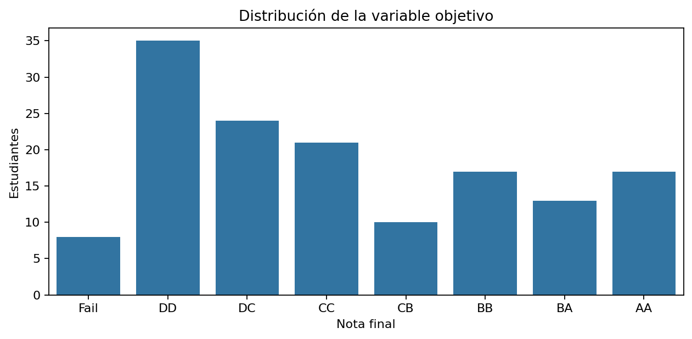
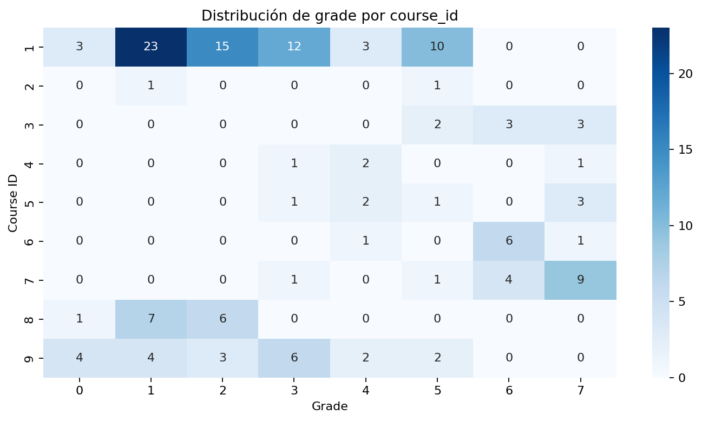
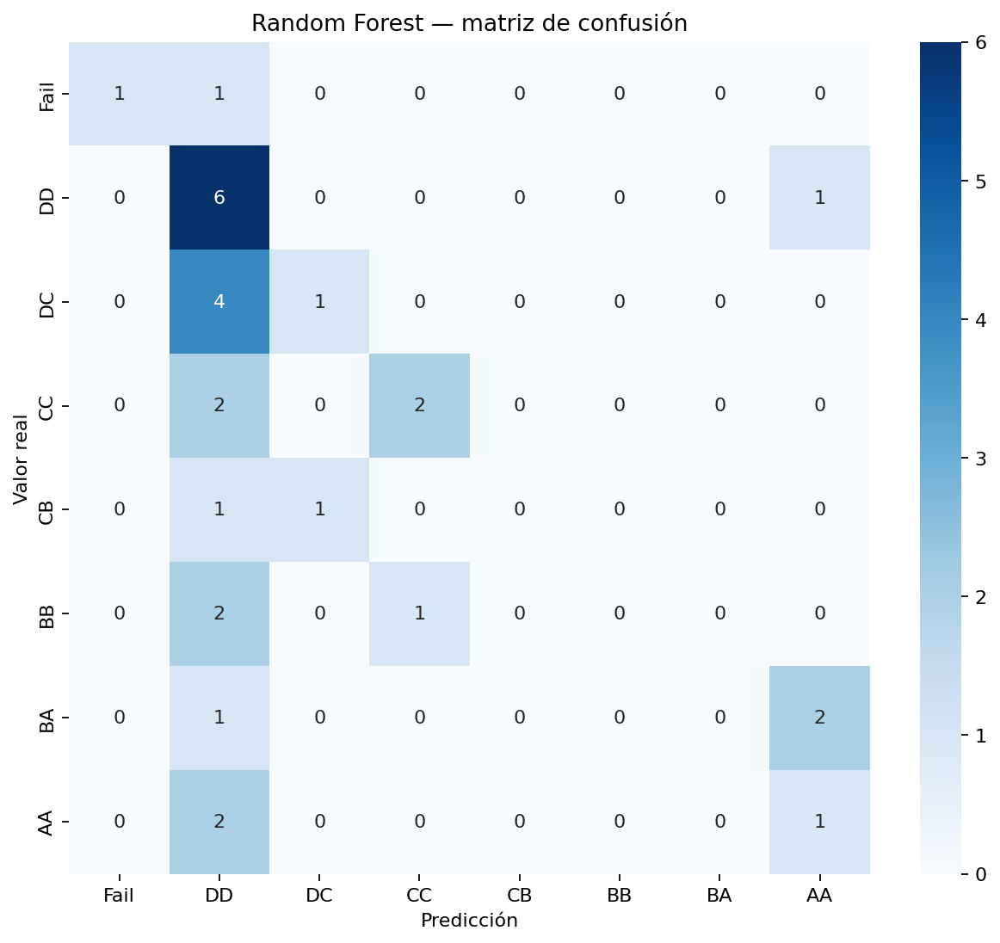
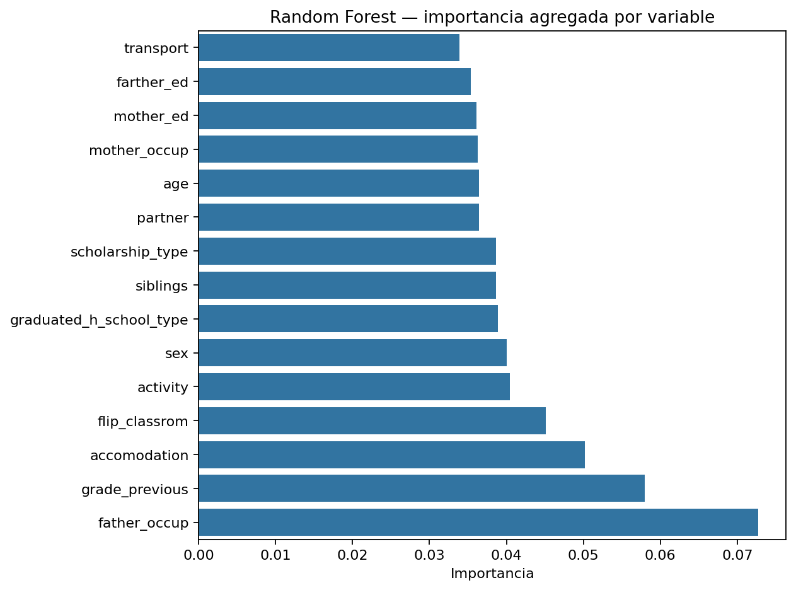

# HESPE — Data Science con PySpark y Spark ML

Proyecto de **Data Science con PySpark / Spark ML** para analizar y clasificar el rendimiento académico final de estudiantes mediante un flujo reproducible que integra EDA, preparación de datos, Machine Learning supervisado, validación cruzada, tuning e interpretación de resultados.

[](https://github.com/Koke-Oliva/hespe-pyspark-student-performance/actions/workflows/notebook-ci.yml)
[](https://www.python.org/)
[](https://spark.apache.org/)
[](https://spark.apache.org/docs/latest/ml-guide.html)

<p align="center">
  
</p>

> **Proyecto formativo de portafolio.** El dataset contiene 145 observaciones. Spark se utiliza para demostrar diseño de pipelines y procesamiento distribuible; este trabajo **no pretende demostrar una mejora de throughput por volumen**.

## Vista rápida

- **Problema:** clasificación multiclase de la nota final en 8 categorías.
- **Datos:** 145 estudiantes, 31 variables predictoras, 1 identificador y 1 target.
- **Stack:** PySpark 4.0.1 · Spark ML · Python · pandas · Matplotlib · seaborn · GitHub Actions.
- **Baseline:** Logistic Regression multinomial.
- **Modelo principal:** Random Forest con 3-fold CV **estratificado** y tuning.
- **Mejor test Accuracy:** **0.3793**.
- **Weighted F1:** **0.3150**.
- **Macro F1:** **0.2839**.
- **Ordinal MAE:** **1.6897 categorías**.
- **Predicciones a ±1 categoría:** **62.07%**.
- **Reproducibilidad:** notebook validado end-to-end con Java 17 + PySpark en GitHub Actions.

El valor del proyecto no está en presentar un modelo de alta precisión, sino en demostrar un flujo completo de **Data Science sobre Spark**: análisis exploratorio, preparación distribuible, modelado supervisado, validación, tuning, evaluación e interpretación; además de reconocer las limitaciones de generalización de un dataset pequeño, desbalanceado y con ocho clases.

---

## Problema y formulación

El caso HESPE plantea portar un modelo predictivo de rendimiento estudiantil a un entorno de procesamiento distribuido. La evaluación académica exige PySpark, un pipeline con preprocesamiento, validación cruzada y estimación, además de selección/tuning del modelo.

La entrega también exige problema/datos, EDA, aprendizaje supervisado en PySpark, conclusiones, orden y reproducibilidad.

### Decisión de modelado

La entrega original aproximaba `grade` como una variable de regresión ordinal. En esta versión se modela principalmente como **clasificación multiclase**, preservando además métricas ordinales para aprovechar el orden natural:

```text
0 Fail → 1 DD → 2 DC → 3 CC → 4 CB → 5 BB → 6 BA → 7 AA
```

Esto permite medir simultáneamente:

- clasificación exacta;
- desempeño por clase;
- distancia entre categoría real y predicha.

---

## Auditoría de datos

La versión utilizada contiene:

- **145 filas**;
- **33 columnas** en el CSV: `student_id` + 31 predictores + `grade`;
- **0 valores faltantes**;
- **0 duplicados completos**;
- **145 IDs de estudiante únicos**;
- **9 valores de `course_id`**;
- 8 clases de target con soporte desigual.

### Distribución del target

| Grade | Etiqueta | N | % |
|---:|---|---:|---:|
| 0 | Fail | 8 | 5.5% |
| 1 | DD | 35 | 24.1% |
| 2 | DC | 24 | 16.6% |
| 3 | CC | 21 | 14.5% |
| 4 | CB | 10 | 6.9% |
| 5 | BB | 17 | 11.7% |
| 6 | BA | 13 | 9.0% |
| 7 | AA | 17 | 11.7% |



La clase minoritaria (`Fail`) tiene solo 8 observaciones. Por esta razón, un split aleatorio y folds no controlados pueden producir evaluaciones inestables.

---

## Decisiones metodológicas

### 1. Schema explícito

El CSV se carga con un `StructType` definido en código en lugar de depender de `inferSchema`. Esto hace la ingestión más auditable y consistente.

### 2. EDA con Spark

Las transformaciones y agregaciones se ejecutan en Spark. Solo resultados agregados pequeños pasan a pandas para visualización.

### 3. `student_id` y `course_id`

- `student_id` se excluye porque identifica cada fila de forma única.
- `course_id` **no se trata como un identificador irrelevante**: tiene 9 categorías y presenta asociación descriptiva con `grade`.
- Se excluye del modelo principal para evitar depender de patrones específicos de cursos concretos cuando el caso plantea generalizar a nuevos contextos académicos.



### 4. Preprocesamiento

Las variables se separan en nominales y ordinales.

**Logistic Regression:**

```text
nominales → StringIndexer → OneHotEncoder
ordinales → VectorAssembler → StandardScaler(withMean=False)
                              ↓
                        VectorAssembler
                              ↓
                 Logistic Regression multinomial
```

**Random Forest:**

```text
nominales → StringIndexer → OneHotEncoder ─┐
ordinales ─────────────────────────────────┼→ VectorAssembler → Random Forest
```

No se estandarizan features para Random Forest. También se evita `StandardScaler(withMean=True)` sobre OHE, porque centrar vectores sparse puede densificarlos y aumentar el consumo de memoria.

### 5. Split y Cross-Validation

El split train/test es estratificado:

- **train:** 116 observaciones;
- **test:** 29 observaciones;
- las 8 clases están presentes en ambos conjuntos.

Dentro de train, los 3 folds de Cross-Validation también se asignan **estratificando por `grade`**, de forma que cada fold contiene ejemplos de todas las clases.

---

## Modelos

### Baseline — Logistic Regression multinomial

Sirve como referencia lineal y permite comprobar si un modelo más flexible aporta mejora.

### Random Forest + tuning

La búsqueda evalúa:

- `numTrees ∈ {100, 200}`;
- `maxDepth ∈ {4, 8}`;
- `minInstancesPerNode ∈ {1, 2}`.

Métrica de selección: **Weighted F1**.

### Mejor configuración CV

```text
numTrees = 200
maxDepth = 4
minInstancesPerNode = 1
impurity = gini
featureSubsetStrategy = auto
```

Mejor Weighted F1 medio en 3-fold CV estratificado: **0.1766**.

---

## Resultados finales

| Modelo | Accuracy | Weighted F1 | Macro F1 | Weighted Precision | Ordinal MAE | ±1 categoría | ±2 categorías |
|---|---:|---:|---:|---:|---:|---:|---:|
| Logistic Regression | 0.2069 | 0.1879 | 0.1461 | 0.1833 | 2.0690 | 0.4828 | 0.6552 |
| **Random Forest tuned** | **0.3793** | **0.3150** | **0.2839** | **0.3492** | **1.6897** | **0.6207** | **0.7586** |

El Random Forest mejora claramente al baseline en las métricas principales, pero el nivel absoluto de desempeño sigue siendo bajo. No se presenta como un modelo listo para decisiones académicas.

### Desempeño por clase — Random Forest

| Clase | Support | Precision | Recall | F1 | FN | FP |
|---|---:|---:|---:|---:|---:|---:|
| Fail | 2 | 1.0000 | 0.5000 | 0.6667 | 1 | 0 |
| DD | 7 | 0.3158 | 0.8571 | 0.4615 | 1 | 13 |
| DC | 5 | 0.5000 | 0.2000 | 0.2857 | 4 | 1 |
| CC | 4 | 0.6667 | 0.5000 | 0.5714 | 2 | 1 |
| CB | 2 | 0.0000 | 0.0000 | 0.0000 | 2 | 0 |
| BB | 3 | 0.0000 | 0.0000 | 0.0000 | 3 | 0 |
| BA | 3 | 0.0000 | 0.0000 | 0.0000 | 3 | 0 |
| AA | 3 | 0.2500 | 0.3333 | 0.2857 | 2 | 3 |

La matriz de errores muestra que el modelo funciona mejor en algunas categorías frecuentes/intermedias y falla especialmente en **CB, BB y BA**, donde el recall del test es 0. Con soportes de 2–3 observaciones por clase, estas métricas tienen alta incertidumbre.



---

## Interpretabilidad

La importancia del Random Forest se agrega desde las features codificadas hacia las variables originales.

Principales variables del modelo final:

| Variable | Importancia |
|---|---:|
| `grade_previous` | 0.0848 |
| `father_occup` | 0.0598 |
| `sex` | 0.0545 |
| `flip_classrom` | 0.0449 |
| `transport` | 0.0445 |
| `scholarship_type` | 0.0418 |
| `activity` | 0.0412 |
| `mother_ed` | 0.0404 |
| `preparation_midterm_company` | 0.0395 |
| `weekly_study_hours` | 0.0390 |



> La importancia es **predictiva, no causal**. Variables como sexo u ocupación parental requieren especial cautela si este tipo de modelo se utilizara para decisiones reales.

---

## Qué demuestra este proyecto sobre Spark

El dataset académico es demasiado pequeño para comparar throughput de Spark frente a pandas o scikit-learn de forma válida.

El valor de PySpark aquí está en demostrar una arquitectura trasladable:

```text
CSV
 ↓
schema explícito
 ↓
auditoría distribuida
 ↓
Spark ML Pipeline
 ↓
StringIndexer / OneHotEncoder
 ↓
VectorAssembler
 ↓
split + CV estratificados
 ↓
model selection / tuning
 ↓
evaluación y análisis de errores
```

Por tanto, la conclusión correcta es:

> **se demuestra uso de primitivas y pipelines escalables de Spark; no se demuestra una ventaja de rendimiento por volumen con 145 observaciones.**

---

## Reproducibilidad

### Entorno

- Python 3.11
- Java 17
- PySpark 4.0.1

```bash
git clone https://github.com/Koke-Oliva/hespe-pyspark-student-performance.git
cd hespe-pyspark-student-performance

python -m venv .venv

# Linux/macOS
source .venv/bin/activate

# Windows PowerShell
# .venv\Scripts\Activate.ps1

pip install -r requirements.txt
jupyter notebook hespe_pyspark_student_performance.ipynb
```

GitHub Actions instala Java/Python, valida el JSON del notebook y lo ejecuta de principio a fin. Los outputs de CI se almacenan como **workflow artifacts**; el workflow final no realiza commits automáticos al repositorio.

---

## Estructura

```text
.
├── .github/
│   └── workflows/
│       └── notebook-ci.yml
├── data/
│   ├── hespe-data.csv
│   └── README.md
├── figures/
│   ├── course_grade_heatmap.png
│   ├── rf_confusion_matrix.png
│   ├── rf_feature_importance.png
│   ├── target_distribution.png
│   └── README.md
├── notebooks/
│   └── original/
│       └── EM8_Jorge_Auad_Oliva.ipynb
├── hespe_pyspark_student_performance.ipynb
├── requirements.txt
├── .gitignore
└── README.md
```

El notebook entregado originalmente en el bootcamp se conserva en `notebooks/original/`; el notebook de la raíz es la versión profesionalizada.

---

## Limitaciones

- **n=145** es pequeño para ocho clases y produce métricas por clase inestables.
- Existe desbalance, con solo 8 casos en `Fail`.
- El test tiene únicamente 29 observaciones.
- `course_id` se excluye para priorizar transferibilidad; esta decisión debería contrastarse mediante validación por curso con más datos.
- El modelo no ha sido validado en otras instituciones, cohortes ni periodos.
- Las variables académicas/demográficas pueden reflejar sesgos estructurales.
- Feature importance no implica causalidad.
- Spark no aporta una ventaja computacional demostrable a esta escala.

## Próximos pasos

1. ampliar la muestra con nuevas cohortes/instituciones;
2. validar por curso e institución con esquemas Group/Temporal holdout;
3. estudiar estrategias específicas para desbalance multiclase;
4. comparar con modelos ordinales;
5. evaluar calibración por clase;
6. realizar análisis formal de fairness antes de cualquier uso operativo.

---

## Dataset y atribución

**Higher Education Students Performance Evaluation (HESPE)** — UCI Machine Learning Repository.

- DOI: https://doi.org/10.24432/C51G82
- autores: Nevriye Yilmaz y Boran Şekeroğlu
- licencia del dataset: **CC BY 4.0**

Más información: [`data/README.md`](data/README.md).

## Contexto académico

Proyecto desarrollado a partir de la evaluación final del módulo de Spark/Big Data del **Bootcamp de Ciencia de Datos — IT Academy / Kibernum, Talento Digital para Chile**. La pauta pedía explícitamente PySpark, pipeline, validación cruzada, tuning, EDA, modelo supervisado, conclusiones y reproducibilidad.
